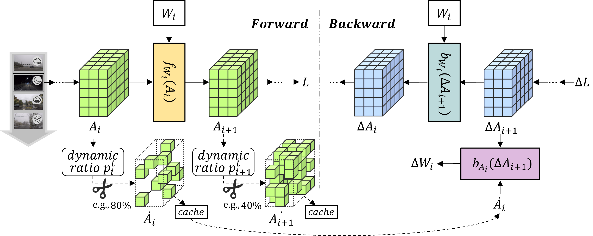

# SURGEON: Memory-Adaptive Fully Test-Time Adaptation via Dynamic Activation Sparsity

**[CVPR 2025 Highlight]**

[📄 Paper](https://arxiv.org/abs/2503.20354) | [⚙️ Installation](#-installation) | [🚀 Usage](#-usage) | [📚 Citation](#-citation)

---

## 🔍 Overview

**SURGEON** is a fully test-time adaptation (FTTA) method designed to be lightweight and highly adaptable. It reduces memory cost during deployment on resource-constrained devices without requiring any architectural changes or altering the original training procedure.

<div align="center">

</div>

We introduce a novel **Dynamic Activation Sparsity** mechanism that prunes activations cached for gradient calculation on a per-layer basis.
This allows SURGEON to **dynamically balance memory and adaptation performance** during test-time adaptation.

---

## 🔥 News

- 🎉 Our paper was **accepted to CVPR 2025** on **Feb 27, 2025**.
- 🚀 We **released the code** on **May 30, 2025**.

---

## 📦 Installation

We follow the environment setup from [RobustBench](https://github.com/RobustBench/robustbench) and [TTA baselines](https://github.com/mariodoebler/test-time-adaptation).

```bash
conda update conda
conda env create -f environment.yml
conda activate surgeon
```

The autoattack code can be found at [Autoattack](https://github.com/fra31/auto-attack/tree/master/autoattack).

---

## 📂 Datasets

We evaluate SURGEON on the following commonly-used corrupted datasets:

- [ImageNet-C](https://zenodo.org/records/2235448)
- [CIFAR-10C](https://zenodo.org/records/2535967/files/CIFAR-10-C.tar?download=1)
- [CIFAR-100C](https://zenodo.org/records/3555552/files/CIFAR-100-C.tar?download=1)

After downloading, update the dataset path in `./conf.py`:

```python
_C.DATA_DIR = "/your/data/path"
```

Recommended directory structure:

```
/your/data/path/
├── Imagenet-C/
├── CIFAR-10-C/
└── CIFAR-100-C/
```

---

## 💾 Pretrained Models

Pretrained weights are sourced from [RobustBench](https://github.com/RobustBench/robustbench).  
After downloading, place them in the `./ckpt` directory with the following structure:

```
./ckpt
├── cifar10/corruptions/Standard.pt
├── cifar100/corruptions/Hendrycks2020AugMix_ResNeXt.pt
└── imagenet/corruptions/Hendrycks2020AugMix.pt
```

---

## 🚀 Usage

To run experiments, use the following commands:

**CIFAR-10C**:

```bash
python test_time.py --cfg cfgs/cifar10_c/das.yaml --BN_only SETTING continual
```

**CIFAR-100C**:

```bash
python test_time.py --cfg cfgs/cifar100_c/das.yaml --BN_only SETTING continual
```

**ImageNet-C**:  
ImageNet-C experiments follow the 10-sequence protocol from [CoTTA](https://github.com/qinenergy/cotta), where `x` ranges from 0 to 9:

```bash
python test_time.py --cfg cfgs/imagenet_c/das_x.yaml --BN_only SETTING continual
```

**Notes**:
- `--BN_only` controls the scope of model updates.  
  - If specified, only BatchNorm layers are updated.
  - If omitted, all layers are updated.
- Before running, ensure the learning rate in the corresponding `das.yaml` matches the setting reported in the paper to reproduce the results.

---

## 📚 Citation

If you find our work useful, please cite us:

```latex
@inproceedings{ma2025surgeon,
  title={SURGEON: Memory-Adaptive Fully Test-Time Adaptation via Dynamic Activation Sparsity},
  author={Ke Ma and Jiaqi Tang and Bin Guo and Fan Dang and Sicong Liu and Zhui Zhu and Lei Wu and Cheng Fang and Ying-Cong Chen and Zhiwen Yu and Yunhao Liu},
  booktitle={CVPR},
  year={2025}
}
```

---

## 🙌 Acknowledgements

This repo is built upon:

- [Test-Time Adaptation](https://github.com/mariodoebler/test-time-adaptation)  
- [RobustBench](https://github.com/RobustBench/robustbench)
- [Autoattack](https://github.com/fra31/auto-attack/tree/master/autoattack)
- [MECTA](https://github.com/SonyResearch/MECTA)
- [DropIT](https://github.com/chenjoya/dropit)

We sincerely thank the authors for the open-source work.

---

## 📬 Contact

If you encounter any problems or have questions, feel free to reach out:

📧 2544552413@mail.nwpu.edu.cn
